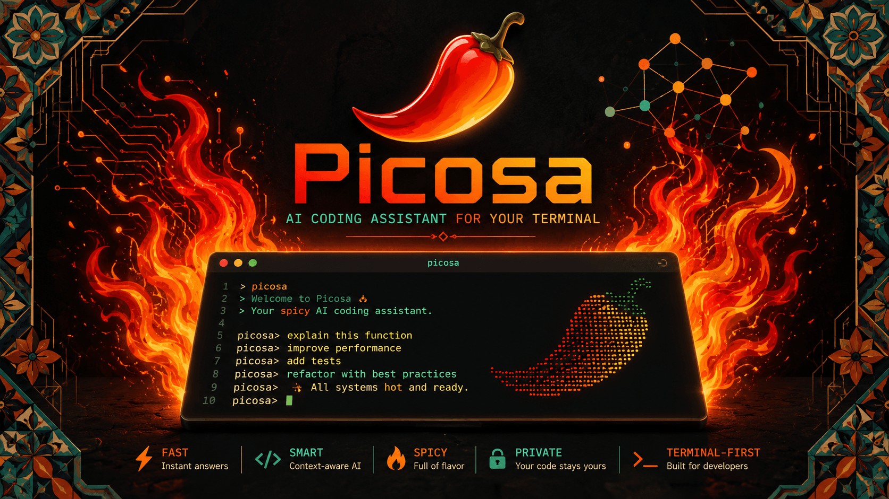

<p align="center">
  
</p>

<p align="center">Made with ♥ by <a href="https://blog.greenpants.net">Greenpants</a></p>

# About Picosa
Local **pi** coding agent conveniently **co**ntainerized and safely **sa**ndboxed.

This lets you run the `pi` coding agent **completely offline** in a simple container, or sandboxed to only allow requests to specific domains.

## Tell me more!
Picosa wraps the [pi.dev](https://pi.dev) coding agent in a hardened Docker container with filesystem isolation and full network control. Run it from any repository and you get a fully functional `pi` agent with Ollama back-end that can only read/write to safe files in this repository.

### Why not just pi?
You shouldn't want a local AI agent able to go rogue, exfiltrating secrets, making sketchy external requests, or accidentally blocking your home network from accessing websites due to spamming. This is a counter to things like OpenClaw that can do anything, out of control, all by itself.

### Isn't pi-sandbox enough?
It might be for your use-case, but `picosa` is particularly portable and secure by running directly inside a container. It also strengthens the security with a second layer of defense, with iptables binaries removed & read-only (or simply no) access to sensitive files whenever the agent is run. You can sit back and let your agent do its thing, without having to worry about (dis)allowing each action. If you start `picosa` fully privately, you can be certain that your agent's requests can never reach the public internet.

With `picosa`, your agents are simple, secure, and safe to use on any repository.

## Getting started
### Prerequisites
- Install [Ollama](https://ollama.com/) locally or on a network device (e.g. a home server).
    - Download at least one Ollama [model](https://ollama.com/models). I recommend `qwen3:35b` if you have $\geq$ 32GB (V)RAM, or `gemma4:e4b` if you have $\geq$ 12GB (V)RAM. Read the model's license to understand what you're allowed to do with it.
    - When running Ollama on a different machine, make sure to "expose Ollama to the network" in its settings or via [environment variable](https://docs.ollama.com/faq#how-can-i-expose-ollama-on-my-network).
- Install [Docker](https://www.docker.com/) locally.

This repository was tested on MacOS (this container, as well as the Ollama server).

### Instructions
1. Clone the repository:
```sh
git clone https://github.com/GreenpantsDeveloper/Picosa.git && cd Picosa
```

2. **Read `picosa.sh` and the `Dockerfile` before you run it**, or share the contents with your newly downloaded Ollama model and ask about it, in case you're unsure what it does (you can soon ask your agent about it, too :-).

3. Set up the environment variables as follows. If you're running Ollama locally, you may leave `OLLAMA_BASE_URL=` empty like that. Note that `localhost` would refer to the container itself, not your host machine, hence `host.docker.internal` instead. You **must** specify the default model for Ollama to use.

```sh
cp .env.example .env
```

```env
# Fill in the .env variables with for instance:

OLLAMA_BASE_URL=http://host.docker.internal:11434/v1
OLLAMA_DEFAULT_MODEL=gemma4:e4b
```

4. Make `picosa` easy to run in the terminal by appending the shell script to your `.zshrc` or `.bashrc` file as an alias:
```sh
picosa() { /your/path/to/repo/Picosa/picosa.sh "\$@"; }
picosaweb() { /your/path/to/repo/Picosa/picosa.sh --web "\$@"; }
```

Restart the terminal (or run e.g. `source ~/.zshrc`) and that's it! You can now run `picosa` for an offline agent, or `picosaweb` for a network-sandboxed variant, in any repository on your machine 🎉

To run `picosa` in a repository of your choice:
```sh
# NOTE: picosa will have read/write access to most files in the directory that you run it from: the directory will be mounted as the /workspace in the container.
cd some/path/to/your/repository

# Run a fully offline pi agent with only LAN-access for Ollama with either:
picosa  # or
./picosa.sh

# Run a network-sandboxed pi agent that can e.g. search the internet with either:
picosaweb  # or
./picosa.sh --online

# Force rebuild the container image if need be:
./picosa.sh --build
```

### What to do next
If you run `picosa` inside Picosa's own repository, you can ask Picosa to add features to itself for you. It will refer to its own `pi` documentation so you won't have to specify how. Give it a try!

If you close the container, `picosa` will clean up. Restarting `picosa` will give you a new `pi` session, similar to running `/new` in `pi`. Refer to [`pi` documentation](https://pi.dev/docs/latest) to learn more about your agent.

Remember to `git commit` changes you wouldn't want to lose, since there is no undo-button. Although you can always ask your agent nicely to undo its last change, as long as you keep the conversation open.

If you'd like to configure `picosa` differently, feel free to adjust the `config/` files in this repository on your local machine. Note that `APPEND_SYSTEM.md` is the set of instructions that is automatically appended to the `pi` agent's own system prompt. It needs to know it is sandboxed, otherwise it will keep trying to make external requests and fail.

---

## Built with

- [pi](https://github.com/earendil-works/pi/tree/main) — The AI coding agent
- [pi-sandbox](https://github.com/carderne/pi-sandbox) — Filesystem & network sandbox extension
- [Ollama](https://ollama.com) — Local model serving
- [Docker](https://docker.com) — Containerization & isolation
- Night-time support from [my two ragdolls](https://www.instagram.com/koffie_karamel) 🐱
